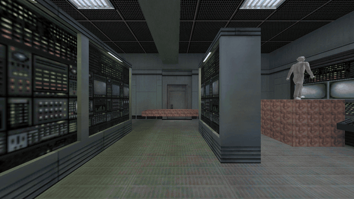
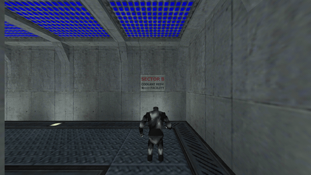

# FamberEngine

A native game engine in **C++ + OpenGL** (pure Win32 + WGL, no external
dependencies), aiming for GoldSource-level features — in about **4,000 lines
of code**. **MIT** licensed.

Loads and renders real Half-Life `.bsp` maps and `.mdl` models.



*Running through a real Half-Life map: baked lightmaps, PVS culling, a
`func_door` opening on approach.*

|  |  |
|:---:|:---:|
| *Multiplayer over UDP: prediction, interpolation, animated players* | *`func_rotating` fan, origin-brush pivot* |

## Features

- **M1 — Rendering, camera, Quake physics.** Win32 + WGL, custom GL 2.0+ loader,
  shader renderer, VBO. Quake/GoldSrc player movement: acceleration/friction,
  air-strafe & **bhop**, jump, wall sliding, step-up. FPS mouse-look camera.
- **M2 — Convex plane brushes.** Brushes as plane sets with swept box-vs-brush
  tracing (Quake-style) → sloped surfaces and ramps.
- **M3 — `.map` levels.** Hammer/Quake `.map` parser (winding auto-corrected),
  spawn from `info_player_start`, plus a `.map` exporter.
- **M4 — Textures & lightmaps.** Procedural per-face textures (named from `.map`),
  face-aligned UVs. **Baked per-face lightmaps**: point lights with shadow rays
  (reusing the box trace), colored light, falloff, ambient. `base * lightmap`.
- **M5 — Real GoldSrc `.bsp` (v30).** Parses all lumps, embedded miptex textures
  with palettes, embedded lightmaps, UVs from texinfo, spawn from entities.
  Collision via **hull-1 clipnodes** (recursive point trace). Tested on real
  Half-Life maps (`boot_camp`, `c0a0`).
- **M6 — `.mdl` studiomodels.** Bones, **skeletal animation** (sequence decode,
  quaternions), palette skins (including the separate `<name>T.mdl`), triangle
  strips/fans. Model viewer with auto-rotate and animation. Tested on `gman`,
  `barney`.
- **M7 — Entity system.** Full BSP entity lump parsing (key-value). Spawns `.mdl`
  models into the world: `monster_*` classnames map to their models, plus any
  entity carrying a `models/*.mdl` key. Positioned, rotated and animated. Walk
  around `c1a0` and meet the scientists, Barney and the G-Man.
- **M8 — Sound.** Software mixer on `waveOut` (22 kHz stereo, 32 channels, own
  mixer thread), WAV loader (PCM 8/16, any rate → resampled). Footstep, jump and
  landing sounds; looping `ambient_generic` sources from BSP entities with
  GoldSrc-style distance attenuation and stereo panning. Synthesized fallback
  sounds when the game's WAVs are absent (built-in level stays audible).
- **M9 — Console & cvars.** GoldSrc-style drop-down console (`` ` `` toggles):
  8x8 bitmap-font overlay renderer, command history, scrollback. Cvars bind
  straight to engine variables — `sv_gravity`, `sv_friction`, `fov`, `volume`,
  `sensitivity`, `cl_showfps`… Commands: `help`, `noclip`, `screenshot`,
  `echo`, `quit`. GoldSrc-style `+command` startup args
  (`FamberEngine.exe -bsp ... +cl_showfps 1 +noclip`).
- **M10 — PVS culling.** BSP nodes/leafs/marksurfaces/visibility lumps; point→leaf
  walk, run-length PVS decompression, per-leaf face marking (recomputed only on
  leaf change; brush-entity faces always drawn). Pixel-identical output, ~2x fps
  on `c1a0` (1869/3695 faces at spawn). `r_novis 1` disables it, `cl_showfps 1`
  shows drawn/total faces. Maps compiled without VIS fall back to full draw.
- **M11 — Multiplayer.** Client-server over UDP (Winsock). Authoritative
  server runs the same `PM_Move` per received usercmd (GoldSrc-style async
  movement), 20 Hz snapshots. Client-side **prediction with reconciliation**:
  on every snapshot the client rewinds to the server state and replays unacked
  cmds — prediction error is exactly 0 on identical simulation. Usercmds sent
  with 8x redundancy against loss; remote players render as `player.mdl`
  (colored box fallback) with smoothing. `-host` serves + plays, `-connect ip`
  joins, `cl_predict 0` shows life without prediction.
- **M12 — PAK archives.** Quake/GoldSrc `pak0..pak9.pak` mounted from the game
  dir; all asset loading (`.bsp`, `.mdl` + `<name>T.mdl`, `.wav`) goes through
  one `fs::read` — loose files win, paks fill the gaps. A WON-style install
  where everything lives in `pak0.pak` runs identically to loose files.
- **M13 — Doors.** `func_door` brush entities move: GoldSrc-style move dir
  (`angle` -1/-2 = up/down, else yaw) and travel (size along dir minus `lip`),
  open on approach, wait, close (reopen if you step back in). Rendered with a
  per-submodel offset; **collision follows the door** — traces run against each
  door's own clipnode hull in door space. In multiplayer doors are simulated
  per-instance for now (no state sync yet). Debug: `setpos x y z`.
- **M14 — Elevators & platforms.** `func_plat` (rises when ridden, Quake-style
  height) and `func_train` following its `path_corner` chain (HL center
  convention, per-corner `wait`, loops). All movers share one system with
  doors, and **riders are carried**: each frame anything you stand on adds its
  movement delta to you — vertical lifts and horizontal platforms both work
  (verified drift 0.00 riding a c1a0e train). `cl_showpos 1` draws the origin.
- **M15 — Mover sync, sounds, fans, interpolation, chat.** In multiplayer the
  **server owns mover simulation** (any player triggers) and snapshots carry
  mover offsets — clients lerp toward them (~9 units behind at train speed).
  Movers got **sounds**: spatialized move loop + stop thunk from `movesnd`/
  `stopsnd`/`sounds` keys. **`func_rotating`** spins (origin-brush pivot
  convention: such models store verts pivot-relative). Remote players render
  through a **100 ms interpolation buffer** instead of exponential smoothing.
  **Chat**: `say <text>` in console, server broadcast, fading overlay.
- **M16 — Skybox, masked textures, WAD archives.** `sky`-textured faces are
  skipped and a **skybox** (six `gfx/env/*.tga`, own TGA loader, Quake side
  orientation) draws behind the world. `{`-prefixed textures are **masked**:
  palette index 255 turns transparent (alpha test, halo-free edges) — fences,
  railings and grates look right. Textures missing from the map are pulled
  from its **WAD3** files (`halflife.wad`…), so multiplayer maps like
  `boot_camp` and `crossfire` render fully textured.
- **M17 — Map logic: buttons, triggers, changelevel.** **E** presses
  `func_button`s, which fire their `target`; doors with a `targetname` are
  trigger-controlled (no proximity opening) and toggle on fire; named trains
  start parked until triggered. `trigger_multiple/once` fire on touch,
  `trigger_teleport` works, and **`trigger_changelevel` loads the next map**
  with landmark carry — walk from `c1a0` into `c1a0d` and the world just
  continues. Trigger brushes and ladders are invisible now. In multiplayer
  buttons go through usercmds (server presses them); changelevel is SP-only.
- **M18 — Logic chains & ladders.** `multi_manager` fans one event out to many
  targets with per-target delays (duplicate `#N` keys handled), `trigger_relay`
  forwards with a delay; delayed fires sit in a queue, loops are depth-guarded.
  Pressing the Office Complex elevator call button now opens both elevator
  doors through the chain. **`func_ladder`** volumes are climbable: no gravity,
  move where you look, jump pushes off.
- **M19 — Water & HUD.** Point-contents via the BSP tree (world + `func_water`
  submodels): in water you **swim** — 3D wish direction, drag, slight sink,
  jump paddles up, step-up climbs you out at the edge. Underwater the view
  tints blue-green; `!`-liquid surfaces render in a **translucent pass**
  (alpha blend, no depth writes). Plus a crosshair (`crosshair 0` hides it).

## Building

Requires MinGW-w64 (in `C:\mingw64`). From the repo root: run `build.bat`, or:

```
g++ -std=c++17 -O2 -DWIN32_LEAN_AND_MEAN -static -static-libgcc -static-libstdc++ ^
    src\game\main.cpp src\platform\gl.cpp -o FamberEngine.exe ^
    -lopengl32 -lgdi32 -luser32 -lwinmm -lws2_32
```

## Running

- `FamberEngine.exe` — play the built-in level. **WASD** move, mouse look,
  **SPACE** jump (hold to bhop), **E** use, **`` ` ``** console, **ESC** quit.
- `FamberEngine.exe -map maps\test.map` — load a `.map` level.
- `FamberEngine.exe -bsp "...\valve\maps\c0a0.bsp"` — a real Half-Life map.
- `FamberEngine.exe -mdl "...\valve\models\gman.mdl"` — model viewer.
- `FamberEngine.exe -host -bsp <map>` — host a game (plays + serves, port 27015).
- `FamberEngine.exe -connect <ip[:port]> -bsp <map>` — join (same map on both sides).
- `FamberEngine.exe -selftest` — headless physics checks.
- `FamberEngine.exe -sndtest` — headless mixer check (plays the built-in sounds).
- `FamberEngine.exe -nettest` — headless loopback server+client prediction check.
- `FamberEngine.exe -genmap out.map` — export the built-in level to `.map`.
- `FamberEngine.exe -shot out.bmp` — render one frame to a file.

## Architecture (`src/`)

```
core/      math.h cvar.h           — vectors / matrices (Z-up); cvar/command registry
           files.h                 — file reads with PAK archive fallback
platform/  gl.{h,cpp}  window.h    — GL loader, window/context/input/screenshot
           sound.h                 — waveOut software mixer + WAV loader
world/     brush.h trace.h         — convex brushes, collision, shadow rays
           level.h map.h           — level (brushes+lights+spawn), .map loader
           bsp.h                   — GoldSrc BSP v30 + WAD3 + hull collision + PVS
           mdl.h                   — .mdl (studiomodel) loader + skeleton
physics/   pmove.h                 — Quake player physics (via a TraceFn)
net/       net.h protocol.h        — non-blocking UDP, wire structs
render/    texture.h lightmap.h    — procedural textures, lightmap baking
           renderer.h model.h      — GL renderer for the level and models
           font.h sky.h            — 8x8 bitmap font overlay; TGA loader, skybox
game/      main.cpp entities.h     — entry point, loop, modes; entity spawning
           audio.h console.h       — game audio, spatialized ambients; console UI
           movers.h triggers.h    — doors/plats/trains/buttons/rotating; trigger_*
           logic.h                 — multi_manager/relay chains, delayed fires
           server.h client.h       — authoritative server; prediction client
```

## Roadmap

1. **M1–M19 (done)** — rendering, physics, `.map`, textures, lightmaps, `.bsp`,
   `.mdl`, entity spawning, sound, console/cvars, PVS culling, multiplayer
   with prediction, PAK archives, doors, elevators/trains, mover sync + sounds,
   func_rotating, interpolation, chat, skybox + masked textures + WAD,
   buttons/triggers/changelevel, multi_manager chains, ladders, water, HUD.
2. Ideas next: sprites (.spr), env_glow, scripted_sequence (NPCs that open
   doors), decals, animated textures (+N frames).

## License

MIT — see [LICENSE](LICENSE).
